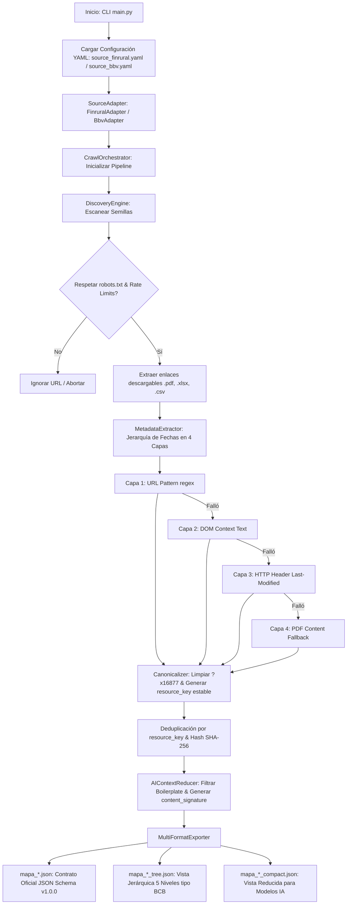

# Prospector Externo Multi-Fuente (`crawler_finrural`)

> **Subsistema responsable:** Equipo 1 — Extracción externa de fuentes  
> **Fuentes integradas:** FINRURAL ([finrural.org.bo](https://www.finrural.org.bo/)) & Bolsa Boliviana de Valores BBV ([bbv.com.bo](https://www.bbv.com.bo/))  
> **Versión:** 1.0.0

---

## 1. Descripción del Proyecto

`crawler_finrural` es la plataforma automatizada, profesional y modular de prospección externa desarrollada por el Equipo 1 de DataX Bolivia. A diferencia de prototipos monolíticos como `example_bcb_crawler`, este sistema implementa una arquitectura basada en **Núcleo Genérico + Adaptadores Declarativos por Fuente (Dataset-First)**.

Mapea de forma dinámica las publicaciones de múltiples entidades financieras (como **FINRURAL** y la **Bolsa Boliviana de Valores BBV**), identifica series periódicas (reportes financieros, memorias anuales, boletines), extrae fechas de vigencia mediante una estrategia en 4 capas, calcula huellas digitales SHA-256, deduplica recursos y exporta simultáneamente tres contratos JSON independientes para producción, visualización y modelos de IA.

---

## 2. Diagrama de Arquitectura y Pipeline



---

## 3. Principios de Diseño y ADRs

### 3.1 Modelo de Dominio Dataset-First (ADR-001)
En lugar de recorrer recursivamente todo el sitio web (lo cual generaría ruido y saturación innecesaria en páginas institucionales como historia o misión), el dominio se organiza en:

```text
Source (FINRURAL / BBV / ASFI)
 └── Datasets (Reporte Financiero Mensual, Memorias Anuales, Estadísticas)
      └── Resources (financiera_01_2026.pdf, Memoria-2024.pdf)
           └── Observations (Metadatos: fecha de corte, SHA-256, tamaño, evidencia)
```

### 3.2 Núcleo Genérico + Adaptadores Declarativos (ADR-002)
El código central (descubrimiento, extracción de fechas, canonicalización, deduplicación, reducción y exportación) es 100% reutilizable. Lo específico de cada fuente vive en un archivo YAML (`config/source_*.yaml`) y su adaptador Python (`FinruralAdapter`, `BbvAdapter`).

### 3.3 Estrategia de Extracción de Vigencia en 4 Capas (ADR-003)
Aplica un orden de costo creciente para resolver la fecha del último dato (`period_end`) sin descargar ni abrir innecesariamente los archivos:
1. **Capa 1 (URL Pattern):** Regex de patrón en el nombre del archivo (`financiera_05_2025.pdf` ➔ `2025-05-31`, confianza `high`).
2. **Capa 2 (DOM Context):** Búsqueda de meses en español y años en el texto ancla o contenedores HTML adyacentes (`medium`).
3. **Capa 3 (HTTP Metadata):** Headers HTTP `Last-Modified` via solicitudes `HEAD` (`low`).
4. **Capa 4 (PDF Content Fallback):** Parsing del contenido interno del archivo en caso de ambigüedad.

### 3.4 Identidad Estable del Recurso (`resource_key`) (ADR-005)
Cada recurso genera una clave estable independiente de la URL (ej. `finrural:reporte_financiero_mensual:2026-01:pdf`). Esto permite al Motor de Conciliación detectar cuando la fuente cambia la URL de descarga sin perder la referencia al recurso original.

### 3.5 Capa de Reducción Semántica para IA (ADR-004)
Filtra el ruido de navegación HTML y genera una `content_signature` para evitar reprocesar contenido equivalente en llamadas a modelos de IA downstream, reduciendo el consumo de tokens en más del 80%.

---

## 4. Ejemplos de Fuentes Integradas

El proyecto incluye dos fuentes completas probadas en producción:

### 4.1 Fuente 1: FINRURAL ([finrural.org.bo](https://www.finrural.org.bo/))
* **Archivo de Configuración:** `config/source_finrural.yaml`
* **Adaptador:** `src/crawler/sources/finrural_adapter.py`
* **Ejecución:**
  ```bash
  python3 -m crawler.main --config config/source_finrural.yaml --output-dir output/
  ```
* **Resultados:** 126 reportes financieros mensuales procesados (de 2016 a 2026).

### 4.2 Fuente 2: Bolsa Boliviana de Valores BBV ([bbv.com.bo](https://www.bbv.com.bo/))
* **Archivo de Configuración:** `config/source_bbv.yaml`
* **Adaptador:** `src/crawler/sources/bbv_adapter.py`
* **Ejecución:**
  ```bash
  python3 -m crawler.main --config config/source_bbv.yaml --output-dir output/
  ```
* **Resultados:** 82 documentos procesados (memorias anuales desde 2004, estados financieros y tarifarios).

---

## 5. Alcance, Capacidades y Limitaciones Técnicas

Para garantizar transparencia de ingeniería, a continuación se detallan los escenarios donde el crawler funciona óptimamente, los casos donde no aplica y lo que requeriría en el futuro.

### 5.1 ¿En qué casos funciona EXCELENTE? (Alcance Operativo)
* **Portales Web Públicos Estructurados:** Sitios de entidades financieras, entes reguladores, bancos centrales y bolsas (WordPress, Drupal, Joomla, HTML estático o dinámico con renderizado de servidor SSR).
* **Enlaces Directos a Archivos Descargables:** Páginas que exponen recursos en formatos `.pdf`, `.xlsx`, `.xls`, `.csv` o `.zip` con hipervínculos `<a>` estándar en el DOM.
* **Publicaciones Periódicas con Naming Predecible:** Documentos organizados por año, mes o boletines donde la fecha es inferible desde la URL, el texto ancla o contenedores HTML.
* **Servidores con Headers HTTP Estándar:** Servidores que responden adecuadamente a peticiones `HEAD` con encabezados `Content-Length`, `Last-Modified` y `ETag`.

### 5.2 ¿En qué casos NO funciona directamente? (Limitaciones del Crawler HTTP)
* **Aplicaciones Single Page (SPA) en React/Vue/Angular sin SSR:** Páginas que no exponen elementos `<a>` en el HTML inicial y generan enlaces dinámicamente mediante código JavaScript ejecutado en el navegador del cliente (`onclick="downloadBlob()"` o llamadas asíncronas WebSocket/FETCH ocultas).
* **Sistemas con CAPTCHA Activo o WAF Interactivo:** Sitios protegidos por Cloudflare (JS Challenge / Turnstile), Akamai Bot Manager o CAPTCHAs que exijan interacción humana previa antes de entregar el archivo.
* **Áreas Protegidas tras Autenticación Obligatoria:** Secciones que requieren inicio de sesión con credenciales (usuario/contraseña), tokens OAuth2 o cookies de sesión privadas.
* **Formularios de Consulta Dinámica POST (ej. ASP.NET ViewState):** Páginas donde la descarga exige enviar un formulario `POST` con variables de estado ocultas (`__VIEWSTATE`, `__EVENTTARGET`) en lugar de URLs de acceso directo.
* **Archivos PDF Escaneados sin Capa de Texto (Imágenes):** PDFs generados a partir de escaneos físicos de papel sin capa de texto seleccionable (OCR).

### 5.3 Roadmap: ¿Qué se necesitaría para soportar esos casos complejos?
* **Módulo Headless Browser (Playwright / Puppeteer):** Para automatizar navegadores reales en sitios SPA con descargas por JavaScript.
* **Session & Auth Manager:** Extensión en `HttpFetcher` para enviar cookies de autenticación o tokens Bearer en sitios con login.
* **Form POST Handler:** Adaptadores especializados para construir peticiones `POST` con estados dinámicos.
* **Integración OCR (Tesseract / Document AI):** Para la Capa 4 de extracción de fechas cuando los PDFs sean imágenes escaneadas.

---

## 6. Formatos de Salida (Multi-Formato — ADR-006)

En cada corrida, el sistema exporta tres archivos JSON en la carpeta `output/`:

1. **`mapa_*.json` (Contrato Oficial Estandarizado — `ExternalSourceMap` v1.0.0):**
   * Consumido por el Motor de Conciliación y Auditoría Interna (Equipo 1 + Equipo 2).
   * Contiene metadatos de Nivel 5: hashes `sha256`, tamaño en bytes, `etag`, `last_modified`, `period_start`, `period_end`, confianza y evidencias.
   * **Validado 100%** contra el esquema formal `schemas/source-map.schema.json` (JSON Schema Draft 2020-12).

2. **`mapa_*_tree.json` (Formato Jerárquico BCB — Tree View):**
   * Compatible con el visor web estático del prototipo (`web/index.html`).
   * Organiza la información en 5 niveles de carpetas finalizando en sufijos `.csv` con atributos `descripcion` y `url_descarga`.

3. **`mapa_*_compact.json` (Vista Compacta para IA):**
   * Matriz reducida sin boilerplate para consumo rápido por agentes LLM.

---

## 7. Buenas Prácticas de Web Scraping y Ética

El cliente HTTP ([`src/crawler/core/fetcher.py`](src/crawler/core/fetcher.py)) incluye controles estrictos para garantizar un rastreo ético y prevenir bloqueos o baneos:

* **Cumplimiento Automático de `robots.txt`:** Utiliza `urllib.robotparser` para verificar dinámicamente que la URL a visitar esté explícitamente autorizada.
* **Rate-Limiting (Control de Frecuencia):** Pausa obligatoria de 1.0 segundo entre peticiones al mismo dominio (`rate_limit_per_second: 1.0`).
* **Optimización con Solicitudes `HEAD`:** Consulta metadatos HTTP sin descargar el cuerpo binario de los archivos PDF.
* **Tolerancia a Fallos y Manejo de HTTP 429:** Reintentos automáticos con backoff exponencial cuando el servidor responde `429 Too Many Requests`.
* **User-Agent Transparente:** Identificación clara: `ProspectorExterno/1.0 (+contacto-proyecto-datax)`.

---

## 8. Estructura del Repositorio

```text
crawler_finrural/
├── config/
│   ├── source_finrural.yaml       # Configuración declarativa de FINRURAL
│   └── source_bbv.yaml            # Configuración declarativa de la Bolsa de Valores BBV
├── schemas/
│   └── source-map.schema.json     # JSON Schema borrador 2020-12
├── src/
│   └── crawler/
│       ├── core/
│       │   ├── models.py          # Modelos de dominio Pydantic v2
│       │   ├── fetcher.py         # Cliente HTTP ético con robots.txt y rate-limit
│       │   ├── discovery.py       # Descubrimiento enfocado en datasets
│       │   ├── extractor.py       # Extractor de vigencia en 4 capas y metadatos
│       │   ├── canonicalizer.py   # Canonicalización de URLs y resource_key
│       │   ├── reducer.py         # Reducción semántica para consumo por IA
│       │   ├── exporter.py        # Exporter multi-formato (Standard, Tree, Compact)
│       │   └── orchestrator.py    # Orquestador del pipeline end-to-end
│       ├── sources/
│       │   ├── base_adapter.py    # Interfaz abstracta para adaptadores
│       │   ├── finrural_adapter.py# Adaptador declarativo para FINRURAL
│       │   └── bbv_adapter.py     # Adaptador declarativo para la Bolsa de Valores BBV
│       ├── validators/
│       │   └── schema_validator.py# Validador de JSON Schema
│       └── main.py                # Punto de entrada CLI
├── tests/
│   ├── test_canonicalizer.py
│   ├── test_exporter.py
│   ├── test_extractor.py
│   ├── test_finrural_adapter.py
│   └── test_models_and_schema.py
├── .gitignore                     # Exclusión de cache, entorno virtual y outputs
├── pyproject.toml                 # Configuración de paquete Python
└── README.md
```

---

## 9. Guía de Extensión: Cómo agregar una nueva fuente (ej. ASFI, APS)

Para agregar una nueva fuente financiera sin modificar el núcleo del crawler:

1. **Crear el archivo YAML de configuración:** Crear `config/source_nueva.yaml` definiendo `base_url`, `seeds`, `allowed_domains` y reglas de exclusión.
2. **Crear el Adaptador:** Heredar de `BaseSourceAdapter` en `src/crawler/sources/nueva_adapter.py` e implementar las reglas de clasificación de datasets y regex de fechas de esa entidad.
3. **Ejecutar:** `python3 -m crawler.main --config config/source_nueva.yaml`

---

## 10. Instalación y Uso

### 10.1 Preparación del Entorno
```bash
python3 -m venv .venv
source .venv/bin/activate
pip install -e .
```

### 10.2 Ejecución de la Prospección Externa
```bash
# Ejecución para FINRURAL
python3 -m crawler.main --config config/source_finrural.yaml --output-dir output/ --verbose

# Ejecución para la Bolsa Boliviana de Valores (BBV)
python3 -m crawler.main --config config/source_bbv.yaml --output-dir output/ --verbose
```

### 10.3 Ejecución de la Suite de Pruebas Automatizadas (Pytest)
```bash
PYTHONPATH=src pytest tests/ -v
```
