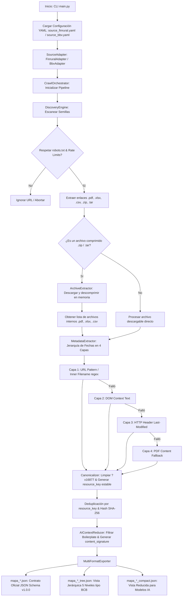

# Prospector Externo Multi-Fuente (`crawler_finrural`)

> **Subsistema responsable:** Equipo 1 — Extracción externa de fuentes  
> **Fuentes integradas:** FINRURAL ([finrural.org.bo](https://www.finrural.org.bo/)) & Bolsa Boliviana de Valores BBV ([bbv.com.bo](https://www.bbv.com.bo/))  
> **Versión:** 1.1.0 (Con soporte de descompresión automática de paquetes `.zip`, `.tar`, `.tgz`)

---

## 1. Descripción del Proyecto

`crawler_finrural` es la plataforma automatizada, profesional y modular de prospección externa desarrollada por el Equipo 1 de DataX Bolivia. A diferencia de prototipos monolíticos como `example_bcb_crawler`, este sistema implementa una arquitectura basada en **Núcleo Genérico + Adaptadores Declarativos por Fuente (Dataset-First)**.

Mapea de forma dinámica las publicaciones de múltiples entidades financieras (como **FINRURAL** y la **Bolsa Boliviana de Valores BBV**), identifica series periódicas (reportes financieros, memorias anuales, boletines), **descomprime automáticamente en memoria contenedores `.zip` / `.tar` para extraer sus documentos internos**, extrae fechas de vigencia mediante una estrategia en 4 capas, calcula huellas digitales SHA-256, deduplica recursos y exporta simultáneamente tres contratos JSON independientes para producción, visualización y modelos de IA.

---

## 2. Diagrama de Arquitectura y Pipeline



---

## 3. Principios de Diseño y ADRs

### 3.1 Modelo de Dominio Dataset-First (ADR-001)
En lugar de recorrer recursivamente todo el sitio web, el dominio se organiza en:

```text
Source (FINRURAL / BBV / ASFI)
 └── Datasets (Reporte Financiero Mensual, Memorias Anuales, Estadísticas)
      └── Resources (financiera_01_2026.pdf, Memoria-2024.pdf)
           └── Observations (Metadatos: fecha de corte, SHA-256, tamaño, evidencia)
```

### 3.2 Núcleo Genérico + Adaptadores Declarativos (ADR-002)
El código central es 100% reutilizable. Lo específico de cada fuente vive en un archivo YAML (`config/source_*.yaml`) y su adaptador Python (`FinruralAdapter`, `BbvAdapter`).

### 3.3 Estrategia de Extracción de Vigencia en 4 Capas (ADR-003)
1. **Capa 1 (URL Pattern):** Regex de patrón en el nombre del archivo (`financiera_05_2025.pdf` ➔ `2025-05-31`, confianza `high`).
2. **Capa 2 (DOM Context):** Búsqueda de meses en español y años en el texto ancla o contenedores HTML adyacentes (`medium`).
3. **Capa 3 (HTTP Metadata):** Headers HTTP `Last-Modified` via solicitudes `HEAD` (`low`).
4. **Capa 4 (PDF Content Fallback):** Parsing del contenido interno del archivo en caso de ambigüedad.

### 3.4 Identidad Estable del Recurso (`resource_key`) (ADR-005)
Cada recurso genera una clave estable independiente de la URL (ej. `finrural:reporte_financiero_mensual:2026-01:pdf`).

### 3.5 Capa de Reducción Semántica para IA (ADR-004)
Filtra el ruido de navegación HTML y genera una `content_signature` para evitar reprocesar contenido equivalente en llamadas a modelos de IA downstream.

### 3.6 Descompresión Automática de Paquetes en Memoria (ADR-007 — Nuevo)
Cuando el prospector descubre un enlace a un archivo comprimido (`.zip`, `.tar`, `.tar.gz`, `.tgz`), el módulo `ArchiveExtractor` lo descarga en memoria, inspecciona su estructura interna y extrae de forma transparente todos los documentos válidos (`.pdf`, `.xlsx`, `.csv`), asignándoles metadatos individuales, SHA-256 y trazabilidad al contenedor de origen (`metadata.extracted_from_archive`).

---

## 4. Ejemplos de Fuentes Integradas

### 4.1 Fuente 1: FINRURAL ([finrural.org.bo](https://www.finrural.org.bo/))
```bash
python3 -m crawler.main --config config/source_finrural.yaml --output-dir output/
```

### 4.2 Fuente 2: Bolsa Boliviana de Valores BBV ([bbv.com.bo](https://www.bbv.com.bo/))
```bash
python3 -m crawler.main --config config/source_bbv.yaml --output-dir output/
```

---

## 5. Alcance, Capacidades y Limitaciones Técnicas

### 5.1 ¿En qué casos funciona EXCELENTE? (Alcance Operativo)
* **Portales Web Públicos Estructurados:** Sitios de entidades financieras, reguladores y bolsas (WordPress, Drupal, Joomla, HTML estático/SSR).
* **Enlaces a Archivos Directos y Comprimidos:** Procesa hipervínculos a `.pdf`, `.xlsx`, `.xls`, `.csv`, `.zip`, `.tar` de forma transparente.
* **Publicaciones Periódicas con Naming Predecible:** Documentos organizados por año, mes o boletines donde la fecha es inferible.
* **Servidores con Headers HTTP Estándar:** Servidores que responden a peticiones `HEAD` y `GET` binarias.

### 5.2 ¿En qué casos NO funciona directamente? (Limitaciones del Crawler HTTP)
* **Aplicaciones Single Page (SPA) en React/Vue/Angular sin SSR:** Páginas que no exponen elementos `<a>` en el HTML inicial.
* **Sistemas con CAPTCHA Activo o WAF Interactivo:** Sitios protegidos por Cloudflare (JS Challenge / Turnstile) o CAPTCHAs.
* **Áreas Protegidas tras Autenticación Obligatoria:** Secciones que requieren inicio de sesión con usuario/contraseña o OAuth2.
* **Formularios de Consulta Dinámica POST (ej. ASP.NET ViewState):** Páginas donde la descarga exige enviar un formulario `POST`.
* **Archivos PDF Escaneados sin Capa de Texto (Imágenes):** PDFs generados a partir de escaneos físicos de papel sin OCR.

---

## 6. Estructura del Repositorio

```text
crawler_finrural/
├── config/
│   ├── source_finrural.yaml       # Configuración declarativa de FINRURAL
│   └── source_bbv.yaml            # Configuración declarativa de la Bolsa de Valores BBV
├── schemas/
│   └── source-map.schema.json     # JSON Schema borrador 2020-12
├── src/
│   └── crawler/
│       ├── core/
│       │   ├── models.py          # Modelos de dominio Pydantic v2
│       │   ├── fetcher.py         # Cliente HTTP ético con robots.txt, rate-limit y fetch_bytes
│       │   ├── discovery.py       # Descubrimiento enfocado en datasets
│       │   ├── extractor.py       # Extractor de vigencia en 4 capas y metadatos
│       │   ├── archive_extractor.py# Descompresión y extracción de archivos .zip/.tar en memoria
│       │   ├── canonicalizer.py   # Canonicalización de URLs y resource_key
│       │   ├── reducer.py         # Reducción semántica para consumo por IA
│       │   ├── exporter.py        # Exporter multi-formato (Standard, Tree, Compact)
│       │   └── orchestrator.py    # Orquestador del pipeline end-to-end
│       ├── sources/
│       │   ├── base_adapter.py    # Interfaz abstracta para adaptadores
│       │   ├── finrural_adapter.py# Adaptador declarativo para FINRURAL
│       │   └── bbv_adapter.py     # Adaptador declarativo para la Bolsa de Valores BBV
│       ├── validators/
│       │   └── schema_validator.py# Validador de JSON Schema
│       └── main.py                # Punto de entrada CLI
├── tests/
│   ├── test_archive_extractor.py  # Pruebas de descompresión de .zip/.tar
│   ├── test_canonicalizer.py
│   ├── test_exporter.py
│   ├── test_extractor.py
│   ├── test_finrural_adapter.py
│   ├── test_models_and_schema.py
│   └── test_orchestrator_archive.py# Prueba de integración del pipeline con comprimidos
├── .gitignore                     # Exclusión de cache, entorno virtual y outputs
├── pyproject.toml                 # Configuración de paquete Python
└── README.md
```

---

## 7. Instalación y Uso

### 7.1 Preparación del Entorno
```bash
python3 -m venv .venv
source .venv/bin/activate
pip install -e .
```

### 7.2 Ejecución
```bash
python3 -m crawler.main --config config/source_finrural.yaml --output-dir output/ --verbose
```

### 7.3 Ejecución de la Suite de Pruebas Automatizadas (Pytest)
```bash
PYTHONPATH=src pytest tests/ -v
```
