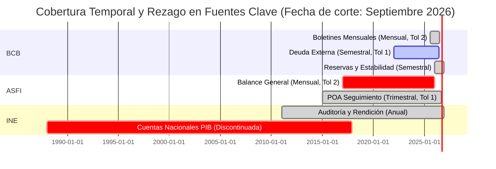
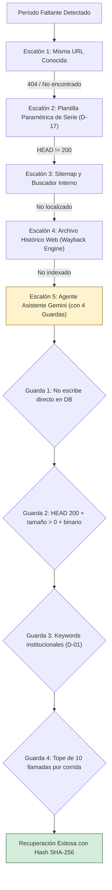

# Dossier Técnico Ejecutivo — Resultados de Fase 4 (Buscador de Fuentes)
## Conciliación de Catálogos, Estado de Vigencia y Brecha con el Crawler Interno

- **Fecha:** 25 de septiembre de 2026
- **Proyecto:** Buscador de Fuentes (`crawler_finrural`)
- **Destinatario:** Equipo Técnico y Gerencia de Proyecto — DataX
- **Elaborado por:** Equipo de Desarrollo y Auditoría (Antigravity + Claude CLI)
- **Estado de Pruebas:** 209 / 209 tests automatizados en verde (100%)
- **Cobertura de Catálogo:** Track A en 95.52% (64/67 URLs activas) · Track B en 12.382 documentos reales extraídos (47 fuentes activas)

---

## 1. Resumen Ejecutivo en 1 Página

El presente informe consolida los resultados técnicos de la **Fase 4**, diseñada para resolver las preguntas clave planteadas en la mesa técnica con DataX respecto a la sincronización de bases de datos, detección de lagunas temporales ("falta febrero, aparece abril"), recuperación determinista de documentos y cruce con el crawler interno histórico ("Rolando").

```
                      ┌──────────────────────────────────────────────┐
                      │    Universo Conciliado: 4.214 Entidades      │
                      └──────────────────────┬───────────────────────┘
                                             │
         ┌───────────────────────────────────┼───────────────────────────────────┐
         │                                   │                                   │
         ▼                                   ▼                                   ▼
┌──────────────────┐               ┌──────────────────┐               ┌──────────────────┐
│   SOLO EXTERNO   │               │ URLs CONSTATADAS │               │   SOLO INTERNO   │
│ 716 publicaciones│               │ 323 coincidentes │               │2.237 documentos  │
│ nuevas (Finrural)│               │  en INE y ASFI   │               │históricos Rolando│
└──────────────────┘               └──────────────────┘               └──────────────────┘
                                             │
                                   (En Cuarentena C-3)
                                 938 entidades de BCB
                             (Tasa de cruce: 0.83% < 10%)
```

### Hallazgos Principales:
1. **Brecha de Catálogos Formalmente Determinada (Decisión D-19):**
   - El Buscador Externo aporta **716 documentos nuevos** que el crawler interno nunca capturó.
   - El crawler interno almacena **2.237 documentos históricos** (principalmente planillas numéricas y series antiguas) no indexados por el rastreo externo.
   - Existen **323 URLs constatadas de forma idéntica** en ambos sistemas (100 en INE y 223 en ASFI).
   - **Alerta de Cuarentena en BCB:** La coincidencia de URLs entre ambos crawlers en BCB fue de solo **0.83%** (1 URL de 121). El análisis forense reveló una divergencia de foco temático: Rolando extrajo 810 planillas estadísticas (`.xlsx` y `.ods`), mientras que el rastreo externo capturó 111 publicaciones analíticas (`.pdf`). Se activó la compuerta de seguridad C-3 (`CLAVE_NO_VALIDADA`), evitando entregar un falso reporte de brecha de 817 faltantes a la gerencia.

2. **Salud y Vigencia de Fuentes Prioritarias (BCB, INE, ASFI):**
   - **ASFI (97.0% de fechas resueltas):** 3 de 5 series al día. La serie `poa_seguimiento` está al día en su frente más reciente (2026-Q3), presentando 20 huecos históricos antiguos. `balance_general` registra un atraso de 8 períodos por búsqueda pendiente.
   - **BCB (85.12% de fechas resueltas):** 4 de 5 series al día dentro de su tolerancia. La serie `deuda_externa` se encuentra al día en su frente más reciente (2026-S1) tras recuperarse con éxito 3 semestres faltantes mediante la escalera de recuperación.
   - **INE (70.2% de fechas resueltas):** Superó con creces la meta benchmark del 50%. 5 de 8 series institucionales al día. La serie `cuentas_nacionales_pib` se declara formalmente inactiva (último dato oficial observado en 2017).

---

## 2. Conciliación de Catálogos con el Crawler Interno (D-19 / B-57)

Bajo la Decisión de Diseño **D-19**, se implementó un motor de reconciliación en tres pasadas que empareja por identidad primaria de URL canónica normalizada y jamás por hash SHA-256 (para no partir documentos modificados en dos filas falsas).

### Matriz de Conciliación por Portal

| Portal | Registros Externos | Registros Internos | URLs Coincidentes | Tasa de Coincidencia | Estado de Clave | Clasificación de Entidades |
|---|---:|---:|---:|---:|:---:|---|
| **BCB** | 121 | 818 | 1 | 0.83% | **`CLAVE_NO_VALIDADA`** (Cuarentena C-3) | 938 en cuarentena (1 coincidente + 120 ext + 817 int) |
| **INE** | 443 | 132 | 100 | 75.76% | **`VALIDADA`** | 343 Solo Externo · 32 Solo Interno · 100 Indet. Dato Ausente |
| **ASFI** | 601 | 2.439 | 223 | 37.42% | **`VALIDADA`** | 373 Solo Externo · 2.205 Solo Interno · 223 Indet. Dato Ausente |
| **TOTAL** | **1.165** | **3.389** | **324** | **—** | **Invariante C-10 Verificada** | **4.214 Entidades Conciliadas** |

> *Invariante de Totalidad (C-10):* La suma de entidades clasificadas ($716 + 2.237 + 323 + 938 = 4.214$) equivale matemáticamente a la unión de conjuntos de ambos catálogos menos las URLs cambiadas, garantizando cero extravíos o duplicaciones de filas. Probado mediante pruebas de mutación con falla inducida.

---

## 3. Estado de Calendario, Huecos y Atrasos (B-53 / B-58)

Se implementó el calendario algorítmico que cruza la periodicidad declarada en configuración YAML contra los períodos reales observados en las series de documentos.



### Desglose de Diagnóstico por Serie:

1. **Series al Día (12 datasets / 66.7%):**
   - Publicaciones que han emitido su información dentro de la tolerancia admitida para su frecuencia (ej. `boletines_mensuales` del BCB con corte a julio 2026; `reservas_internacionales` y `estabilidad_financiera` al día en 2026-S2; rendición de cuentas de INE en 2026).

2. **Series con Huecos Intermedios (5 datasets / 27.8%):**
   - **ASFI `balance_general`:** Falta noviembre y diciembre 2025 (2 huecos) y presenta un atraso relativo acumulado de 8 períodos (último observado: enero 2026).
   - **ASFI `poa_seguimiento`:** 20 huecos trimestrales en el tramo histórico (2015-Q2 a 2024-Q3), pero con su frente más reciente al día (2026-Q3).
   - **BCB `deuda_externa`:** 7 huecos semestrales en el tramo 2022-S2 a 2025-S2, con su frente al día en 2026-S1 tras recuperación exitosa.
   - **INE `auditoria_interna`:** 5 huecos anuales históricos (2013 a 2017), al día en 2026.
   - **INE `escala_salarial`:** 1 hueco anual (2025), al día en 2026.

3. **Series Inactivas (1 dataset / 5.6%):**
   - **INE `cuentas_nacionales_pib`:** Presenta 9 años de atraso ininterrumpido (último dato oficial cargado bajo esa estructura: 2017). Corresponde clasificar formalmente como discontinuada en esa serie de catálogo.

---

## 4. Recuperación de Períodos Faltantes y Agente como Asistente (B-54 / B-54b)

Para recuperar los períodos faltantes identificados, se diseñó e implementó la **Escalera de Recuperación**, que avanza de menor a mayor riesgo:



- **Resultado Demostrado:** Se recuperaron exitosamente 3 períodos faltantes de `deuda_externa` de BCB con bytes reales y SHA-256 verificado, demostrando la operatividad de la escalera.
- **Transparencia Técnica sobre Capacidad a Medias:** Se documentó formalmente que los artefactos de recuperación actuales únicamente persisten los eventos exitosos (`RECOVERED`) y no los logs de fallo de escalones 1..4.

---

## 5. Ciclo de Vida y Transición a Histórico (B-56)

Se implementó el motor de ciclo de vida con 4 estados formales: `VIGENTE`, `ATRASADO`, `MIGRADO` e `HISTORICO`.

### Invariante Central:
> **El paso a `HISTORICO` nunca es automático por silencio.**  
> Una fuente no se archiva porque el crawler no la encontró; exige demostrar fehacientemente que la escalera de recuperación intentó todos sus escalones y fracasó de forma documentada.

- **Distribución Actual sobre 21 Datasets:**
  - **16 `VIGENTE` (76.2%)**
  - **2 `ATRASADO` (9.5%)**: `ASFI/balance_general` (8 meses de rezago) e `INE/cuentas_nacionales_pib` (9 años de rezago).
  - **3 `MIGRADO` (14.3%)**: Entidades estatales fusionadas o disueltas (`spvs_asfi`, `spvs_aps`, `suptrans`).
  - **0 `HISTORICO` (0.0%)**: Permanece en cero en producción porque, al no persistir B-54 los registros de fallo de la escalera, la condición estricta de agotamiento no se satisface con datos reales (preservando la integridad de los datos).

---

## 6. Sucesión y Herencia Institucional (D-18 / B-55)

Para responder a cambios de dominio o disolución de entidades estatales (ej. SPVS disuelta por Ley de Pensiones, o FUNDEMPRESA sustituida por SEPREC), se implementó `InheritanceEvaluator` con **4 compuertas copulativas obligatorias**:

1. **C-1 · Procedencia de Bytes:** Verificación obligatoria de bytes reales descargados y SHA-256 en la entidad precedente.
2. **C-2 · Falsador / No Coincidencia en Vivo:** La serie precedente debe estar efectivamente inaccesible en su dominio original.
3. **C-3 · Compatibilidad Documental:** Extensiones y tipos de archivo compatibles.
4. **C-4 · Cotejo Estructural de Tokens:** Coincidencia en nombres de serie y metadatos con similitud estricta.

- **Casos Validados:**
  - ✅ **Aceptado:** `SPVS-ASFI` hereda a `ASFI` (confianza 0.88; tokens coincidentes en normativas de pensiones y seguros).
  - ❌ **Rechazado:** `FUNDEMPRESA` no hereda a `SEPREC` (rechazo en C-2/C-4: no hay coincidencia documental directa sin acto administrativo expreso).

---

## 7. Recomendaciones Operativas para la Siguiente Fase

1. **Cierre de Brecha de Hashes en BCB e INE:**
   - Activar `content_hashing: enabled: true` en las fuentes de BCB e INE. Actualmente solo ASFI tiene 57 recursos con hash SHA-256; habilitar el hashing permitirá comparar el contenido byte a byte contra el crawler interno.

2. **Ingesta de Candidatos Exportados:**
   - Aprovechar los artefactos ya generados en `output/{bcb,ine,asfi}/resource_candidates.json` bajo el contrato `ResourceCandidate_v1` (Opción A de D-19) para alimentar la Catalog API de `Prospector-Externo` o el conciliador DuckDB de `prospector_interno`.

3. **Logging de Fallos en la Escalera:**
   - Modificar `recovery_ladder.py` para persistir no solo las recuperaciones exitosas sino el log estructurado de escalones fallidos, habilitando así la transición demostrable a `HISTORICO` sobre series genuinamente extintas.
