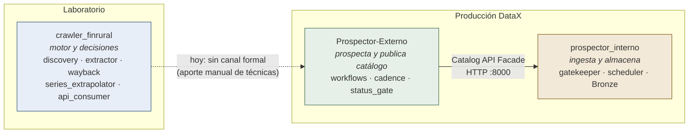
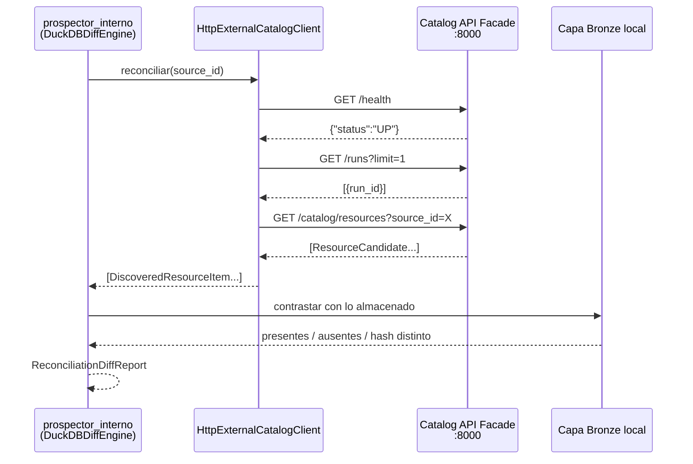
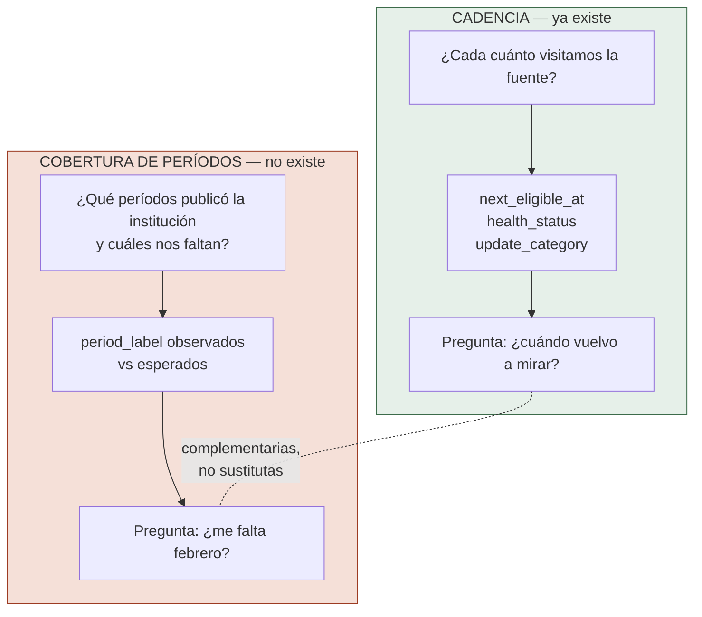
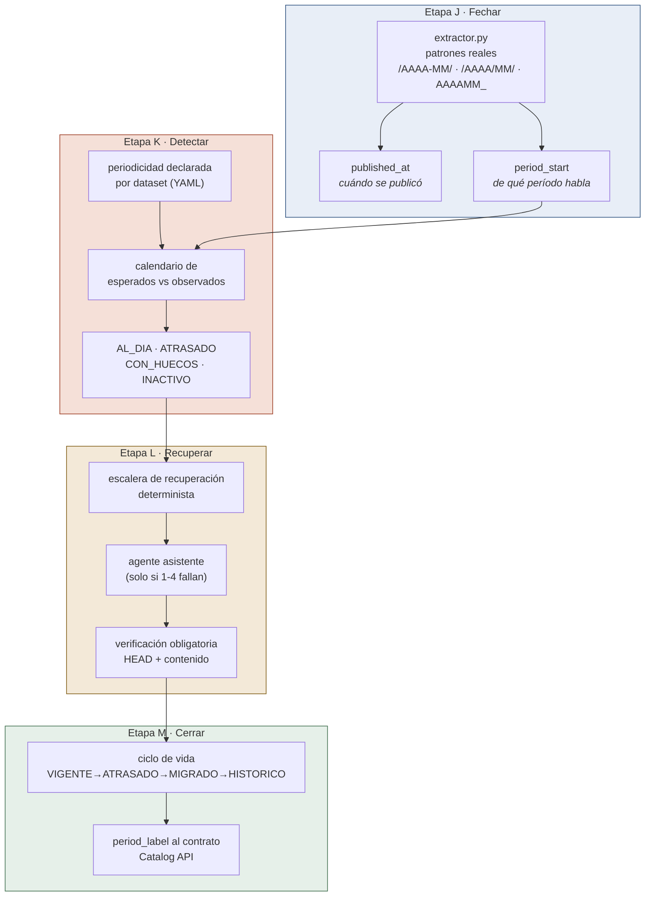
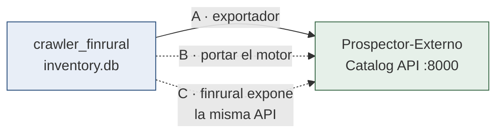
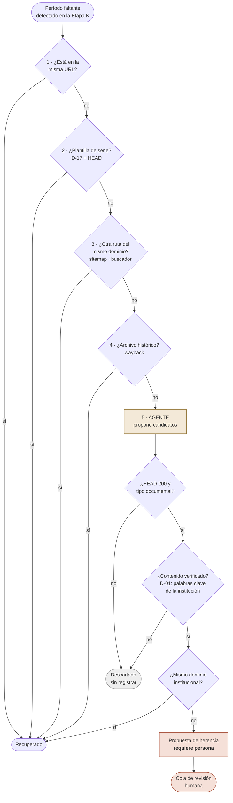
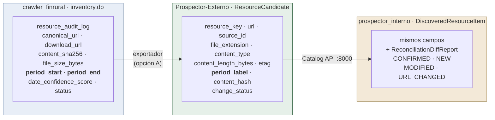

# Arquitectura de integración — los tres sistemas y dónde aterriza la Fase 4

Documento de referencia. Se consulta antes de decidir **en qué repositorio**
va una capacidad nueva y **qué contrato** debe respetar.

Levantado el 2026-09-23 leyendo el código de los tres repositorios, no la
documentación de ninguno.

```
Pasantía Programas/Datax/
├── crawler_finrural/      ← este proyecto (motor y laboratorio)
├── Prospector-Externo/    ← clonado de Jugodenaranja3/Prospector-Externo
└── prospector_interno/    ← clonado de Douke017/prospector_interno
```

---

## 1. El hallazgo que ordena todo: son tres sistemas, no dos

Hasta ahora este proyecto habló de «crawler interno» y «crawler externo» como
si fueran dos. Son tres, y `crawler_finrural` **no es** el prospector externo
que el interno consume.

| Sistema | Paquete | Qué es | Expone |
|---|---|---|---|
| `crawler_finrural` | `crawler` | El motor de descubrimiento y extracción. 31 módulos: discovery, orchestrator, extractor, wayback, series_extrapolator, api_consumer | Nada por HTTP (solo un dashboard local) |
| `Prospector-Externo` | `prospector_externo` | El prospector entregado a DataX. Hexagonal, con workflows propios (html, javascript, api) | **Catalog API Facade** (FastAPI) |
| `prospector_interno` | `prospector_interno` | La plataforma de ingesta (Portal Nexus). Hexagonal, capa Bronze, gatekeeper, scheduler | API propia + **puente de conciliación** |



**La consecuencia práctica.** Todo lo que la Fase 4 construya en
`crawler_finrural` no llega al interno por sí solo. La línea punteada del
diagrama es el problema arquitectónico real de esta fase, y hay que elegir
explícitamente cómo cerrarla (sección 5).

---

## 2. El contrato de integración ya existe

No hay que diseñarlo: está implementado en
`prospector_interno/adapters/external/rest_prospector_client.py` y servido por
`Prospector-Externo/apps/catalog_api/main.py`.



### Los campos del contrato

`ResourceCandidate` (externo) → `DiscoveredResourceItem` (interno):

```
resource_key · url · source_id · title · file_extension
content_type · content_length_bytes · last_modified_header · etag
period_label · content_hash · change_status
```

**`period_label` es la bisagra.** Es el único campo del contrato que expresa a
qué período pertenece un documento, y es exactamente lo que la Etapa J de la
Fase 4 tiene que producir. Hoy nuestro motor lo deja vacío en el 97% de BCB y
el 99,5% de INE: **el contrato tiene el campo, nosotros no tenemos el dato.**

### Categorías de conciliación que el interno ya calcula

| Categoría | Significado |
|---|---|
| `CONFIRMED` | Está en ambos y coincide |
| `NEW` | El externo lo descubrió y el interno no lo tiene |
| `MODIFIED` | Está en ambos con hash distinto |
| `URL_CHANGED` | El mismo recurso cambió de dirección |

`URL_CHANGED` merece atención: **el interno ya modela que un recurso se mueva
de URL**, que es la mitad de lo que pidió la reunión. Lo que no existe en
ningún lado es detectar que un período *falta*.

---

## 3. Qué ya existe y no hay que volver a construir

Esta sección evita el error más caro posible en esta fase: reimplementar algo
que ya está.

### Existe en `Prospector-Externo`

| Componente | Qué hace | ¿Sirve para la Fase 4? |
|---|---|---|
| `application/cadence_evaluator.py` | Ajusta `next_eligible_at` y `health_status` según si hubo cambios | **Parcialmente** — ver abajo |
| `domain/health.py` | `ACTIVE` · `WARNING` · `SUSPENDED` con máquina de estados | Sí, para el ciclo de vida |
| `domain/cadence.py` | `DAILY` · `WEEKLY` · `MONTHLY` | Insuficiente, ver abajo |
| `application/status_gate.py` | Compuerta de estado de corrida | Sí |
| `workflows/javascript_workflow.py` | Portales que renderizan en cliente | Sí |

### Existe en `crawler_finrural`

| Componente | Qué hace |
|---|---|
| `core/wayback_engine.py` | Recuperación desde el archivo histórico |
| `core/series_extrapolator.py` | Extrapolación de series bajo D-17, con HEAD obligatorio |
| `core/extractor.py` | Tres capas de extracción de fecha (URL, DOM, HTTP) |
| `core/fetcher.py::_ask_gemini_for_alternatives` | **El agente proponiendo URLs alternativas** |
| `core/url_resolver.py` · `contingency_engine.py` | Resolución y contingencia |

### La distinción que hay que respetar: cadencia no es cobertura

Es el punto más fácil de confundir y el más caro de confundir.



Una fuente puede tener `health_status: ACTIVE` y cadencia perfecta —la
visitamos todos los días, responde 200, no hay errores— y aun así **faltarnos
febrero**, porque la cobertura de períodos no se mide en ningún lado.

Verificado: no hay ninguna lógica de `missing_period`, `gap` ni
`expected_period` en los tres repositorios.

**Además, `UpdateCategory` solo admite `DAILY`, `WEEKLY` y `MONTHLY`.** Las
series bolivianas incluyen boletines trimestrales y memorias anuales, que hoy
no se pueden expresar. La Fase 4 necesita ampliar ese enum o declarar la
periodicidad aparte.

---

## 4. La arquitectura de la Fase 4

Cuatro capas encadenadas. Cada una consume la salida de la anterior.



**Por qué el orden no es negociable.** Sin `period_start` no hay calendario;
sin calendario no se sabe qué recuperar; sin recuperación agotada no se puede
archivar con honestidad; y `period_label` —el campo del contrato— es el
producto final de toda la cadena.

---

## 5. Dónde vive cada capacidad

La pregunta que este documento existe para responder.

| Capacidad | Repositorio | Por qué |
|---|---|---|
| Patrones de fecha, capas 2 y 3 | `crawler_finrural` | El extractor vive acá |
| Periodicidad declarada por dataset | `crawler_finrural` (YAML) | D-07: configuración, no código |
| Calendario de huecos | `crawler_finrural` | Consume `inventory.db` |
| Escalera de recuperación | `crawler_finrural` | Reusa wayback y series_extrapolator |
| Agente asistente | `crawler_finrural` | `_ask_gemini_for_alternatives` ya está acá |
| Ciclo de vida y salud | **`Prospector-Externo`** | `HealthStateMachine` ya existe allá |
| Periodicidad ampliada (trimestral, anual) | **`Prospector-Externo`** | `UpdateCategory` vive allá |
| `period_label` en el contrato | **`Prospector-Externo`** | Es quien sirve la Catalog API |
| Conciliación y diff | **`prospector_interno`** | `DuckDBDiffEngine` ya existe allá |

### El puente que falta, y las tres formas de cerrarlo

`crawler_finrural` produce el dato y `Prospector-Externo` lo publica, pero hoy
no hay canal entre ambos.



| Opción | Qué implica | Riesgo |
|---|---|---|
| **A · Exportador** — `inventory.db` → formato que el externo ingiere | Bajo acoplamiento, reversible, entrega rápida | Dos motores conviviendo, doble mantenimiento |
| **B · Portar el motor** al externo | Un solo motor, arquitectura limpia | Alto: reescribir 31 módulos en hexagonal |
| **C · `crawler_finrural` expone la misma Catalog API** | El interno podría consumirnos directo | Duplica la fachada; dos sistemas dicen ser «el externo» |

**Recomendación: A.** Es la única que entrega valor dentro de la Fase 4 sin
reescribir nada, y no cierra la puerta a B más adelante. **La decisión formal
queda pendiente** y debe escribirse en `docs/decisiones.md` antes de B-57.

### Colisión de puertos, a resolver antes de integrar

`Prospector-Externo/apps/catalog_api` sirve en **:8000**, y el interno busca
ahí por defecto (`PROSPECTOR_EXTERNO_URL`). Nuestro `dashboard_server.py`
también levanta en **127.0.0.1:8000**. No pueden correr a la vez. El dashboard
debe moverse de puerto.

---

## 6. El agente dentro del ciclo de recuperación

La reunión pidió que el agente ayude a buscar la fuente perdida. Ya existe el
mecanismo —`_ask_gemini_for_alternatives`— y **ya causó el peor error
documentado del proyecto**, así que entra con guardarraíles.



### Por qué el agente va en el escalón 5 y no antes

Los escalones 1 a 4 son **deterministas y verificables**. El agente es
**generativo y ha fallado antes**. D-01 nació precisamente de esto: Gemini
sugirió `bcp.org`, `ibce.org.bo` y `cadex.org` para tres instituciones
distintas, y las tres eran organizaciones equivocadas que respondían 200.

Ponerlo último significa que **solo opina cuando nada determinista funcionó**,
que es donde su costo se justifica y donde su error es más fácil de atrapar.

### Reglas que el agente no puede saltarse

1. **Nunca escribe en `inventory.db` directamente.** Propone candidatos; quien
   los admite es la verificación.
2. **Toda propuesta pasa por HEAD** con status 200, tamaño mayor a cero y tipo
   documental (D-17).
3. **Toda propuesta pasa por verificación de contenido** con palabras clave de
   la institución (D-01). Un 200 no prueba nada.
4. **Cambio de dominio institucional ⇒ nunca automático.** Eso es una herencia
   y va a cola de revisión humana con su evidencia.
5. **Presupuesto acotado por corrida.** La cuota de Gemini ya se consumió sin
   querer una vez en este proyecto (D-08); el agente lleva tope de llamadas y
   se registra cuántas hizo.
6. **Queda registrado en qué escalón apareció cada recuperación.** Es lo que
   dirá, con datos, si el agente aporta o si los cuatro deterministas bastan.

---

## 7. Modelo de datos: de dónde sale cada campo



### Correspondencias y huecos

| `inventory.db` | `ResourceCandidate` | Estado |
|---|---|---|
| `canonical_url` | `url` | directo |
| `content_sha256` | `content_hash` | directo |
| `file_size_bytes` | `content_length_bytes` | directo |
| `resource_id` | `resource_key` | directo (mismo formato) |
| `period_start` + `period_end` | `period_label` | **requiere formato acordado** |
| `date_confidence_score` | — | **no existe en el contrato** |
| — | `etag` · `last_modified_header` | **no los guardamos** |
| — | `change_status` | lo calcula el externo |

Dos huecos que hay que resolver en la Fase 4:

- **`date_confidence_score` no tiene destino.** Si el externo publica un
  `period_label` sin decir cuánta confianza tiene, el interno no puede
  distinguir una fecha leída de la URL de una inferida del texto. Conviene
  proponer que el contrato lo lleve.
- **No guardamos `etag` ni `last_modified_header`.** Son la vía barata de
  detectar que un documento cambió sin volver a descargarlo, y el contrato ya
  los tiene previstos.

---

## 8. Lo que este documento deja decidido y lo que no

**Decidido y verificado en código:**

- Son tres sistemas; `crawler_finrural` no es el prospector externo.
- El contrato de integración existe y es la Catalog API en :8000.
- `period_label` es la bisagra entre la Fase 4 y la integración.
- Cadencia y cobertura de períodos son cosas distintas; la primera existe, la
  segunda no existe en ningún repositorio.
- El agente entra en el escalón 5, después de lo determinista.

**Pendiente de decisión formal en `docs/decisiones.md`:**

- Opción A, B o C para cerrar el puente `crawler_finrural` → `Prospector-Externo`.
- Formato exacto de `period_label`.
- Si `date_confidence_score` se agrega al contrato.
- Puerto nuevo para `dashboard_server.py`.
- Ampliación de `UpdateCategory` a trimestral y anual.
