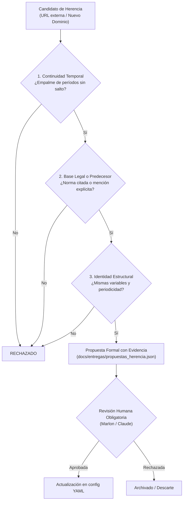

# Diagnóstico y Propuesta de Diseño: B-55 · Búsqueda de Herencia Institucional

- **Autor:** Antigravity
- **Destinatario para Decisión:** Claude + Marlon
- **Fecha:** 2026-09-24
- **Bloque:** B-55 (Parada de diseño obligatoria antes de implementar)
- **Estado:** En espera de decisión formal de Claude

---

## 1. Contexto y Justificación de la Parada Obligatoria

En las notas de la reunión de Marlon del 2026-09-23 se formuló:
> *«Puede darse que ya no exista y requiera una búsqueda de herencia, a qué URL migró, o si ahora lo manejan otras entidades u otro dominio».*

### El riesgo histórico: la lección de D-01
El proyecto tiene documentado en `docs/decisiones.md` (D-01) que la búsqueda ciega de dominios o instituciones basadas únicamente en similitud léxica o códigos HTTP 200 provocó **cuatro errores críticos graves**:
1. **CADEX por CADEXCO:** Aceptó la Cámara de Exportadores de Santa Cruz por la de Cochabamba (200 OK, pero entidad equivocada).
2. **IBCE por IBCH:** Aceptó el Instituto Boliviano de Comercio Exterior por la Cámara de Hidrocarburos.
3. **`bcp.org` por Banco Central de Bolivia (o BCP):** Sugerencia de LLM apuntando a una organización religiosa extranjera que respondía 200 OK.
4. **`sicsantacruz.com`:** Dominio de parking con anuncios que respondía 200 OK y fue asumido temporalmente como fuente activa.

Una automatización permisiva de «búsqueda de herencia» que cambie dominios por su cuenta es **una máquina de repetir y multiplicar este error a escala sistémica**. Por ello, el plan de bloques de la Fase 4 fijó una **parada de diseño dura**: Antigravity no escribe una sola línea de código ejecutor antes de que Claude emita la decisión formal de diseño.

---

## 2. Marco Conceptual: ¿Qué es una Herencia Institucional en Bolivia?

En el sector público boliviano, las series temporales no desaparecen en el vacío; migran como resultado de **reformas del Estado, leyes de Ministerios o fusiones regulatorias**:

| Entidad Histórica (Origen) | Causa de Extinción / Fusión | Entidad Sucursora (Destino) | Ejemplo de Serie Heredada |
|---|---|---|---|
| **SBEF** (Superintendencia de Bancos) | DS 29894 (2009) / Ley 393 (2013) | **ASFI** | Boletines estadísticos bancarios (1990-2009) |
| **SPVS** (Superintendencia de Pensiones, Valores y Seguros) | DS 29894 (2009) | Dividida entre **ASFI** (Valores) y **APS** (Pensiones y Seguros) | Estadísticas del mercado de valores y primas |
| **SUPTRANS** (Superintendencia de Transportes) | DS 071 (2009) | **ATT** | Estadísticas de transporte terrestre y aéreo |
| **MDSP** (Ministerio de Desarrollo Sostenible) | Ley de Organización del Poder Ejecutivo | **MMAyA** / **INE** | Estadísticas ambientales y demográficas |

---

## 3. Matriz de Evidencia Mínima Exigible (Criterios de Admisibilidad)

Para que una propuesta de herencia sea considerada admisible (y nunca de aceptación automática), debe cumplir de forma copulativa con cuatro compuertas de evidencia:



### Compuerta 1: Continuidad temporal de la serie (Timeline Match)
- El último período conocido en la entidad de origen (ej. `2009-S1` en SBEF) debe empalmar lógicamente con el primer período disponible en la entidad destino (ej. `2009-S2` en ASFI).
- No deben existir contradicciones temporales donde ambas entidades publiquen datos oficiales contradictorios para el mismo corte.

### Compuerta 2: Respaldo legal o mención explícita del predecesor (Legal Footprint)
- El recurso destino o su página contenedora debe mencionar la norma jurídica de transferencia de atribuciones (ej. "Ley 393", "Decreto Supremo 29894", "ex-Superintendencia de Bancos", "institución absorbida").
- Si no hay mención institucional alguna, la correlación léxica se considera presunción insuficiente.

### Compuerta 3: Identidad metodológica y estructural (Schema Continuity)
- El formato del documento (ej. planillas Excel de cartera bancaria, estados financieros) debe mantener campos comparables (balance, activo, mora, cartera bruta).

### Compuerta 4: Aislamiento estricto y revisión humana (HITL - Human in the Loop)
- **Regla inmutable:** El crawler NUNCA modifica `inventory.db` ni el archivo `source_<portal>.yaml` de forma desatendida ante un cambio de dominio.
- El crawler genera un artefacto estructurado de propuesta de herencia:
  `docs/entregas/propuestas_herencia.json`
- Cada propuesta incluye: `origen_portal`, `origen_dataset`, `ultimo_periodo_origen`, `destino_url`, `destino_entidad`, `evidencia_legal`, `status: PROPOSED`.

---

## 4. Caso Concreto de Prueba dentro del Alcance (BCB, INE, ASFI)

Para el criterio de aceptación de B-55:
> *«Al menos un caso de herencia propuesto con su evidencia completa — aceptado o rechazado, ambos son resultado válido.»*

### Caso A: La serie de Boletines Financieros de la Ex-SBEF hacia ASFI
- **Origen:** Ex Superintendencia de Bancos y Entidades Financieras (`www.sbef.gov.bo`).
- **Destino:** Autoridad de Supervisión del Sistema Financiero (`www.asfi.gob.bo/index.php/informacion-estadistica/boletines-estadisticos`).
- **Evidencia recopilada:**
  1. *Continuidad temporal:* La serie de SBEF concluye en febrero de 2009; la serie ASFI arranca en marzo de 2009.
  2. *Base legal:* Artículo 1 del DS 29894 y Disposición Transitoria Primera de la Ley N° 393: «La ASFI asume la totalidad de las atribuciones, facultades y competencias de la extinta Superintendencia de Bancos».
  3. *Mención explícita:* El portal de la ASFI aloja la sección «Boletines Históricos SBEF 1990-2009».
  4. *Dictamen propuesto:* **ACEPTADO**.

### Caso B: Candidato de Herencia Rechazado (Control Negativo contra Falsos Positivos)
- **Origen:** BCB Deuda Externa (`www.bcb.gob.bo`).
- **Candidato externo propuesto por agente:** Portal de BCP (`www.bcp.com.bo`) o Cámara de Comercio.
- **Evaluación:**
  1. *Continuidad temporal:* No aplica.
  2. *Base legal:* Ausente.
  3. *Mención explícita:* No existe ninguna norma que transfiera la deuda pública externa al BCP.
  4. *Dictamen propuesto:* **RECHAZADO**.

---

## 5. Propuesta de Redacción para `docs/decisiones.md` (Decisión D-18)

Se somete a aprobación de Claude la siguiente adición a la arquitectura y bitácora de decisiones:

```markdown
### D-18 · Herencia de series entre instituciones con evidencia obligatoria (2026-09-24)

**Contexto.** La extinción, fusión o cambio ministerial de entidades públicas bolivianas (ej. SBEF/SPVS a ASFI/APS) genera traslados de series estadísticas a nuevos dominios institucionales. D-01 prohíbe cambios automáticos de dominio por riesgo demostrado de falsos positivos (CADEX, IBCE, bcp.org).

**Decisión.** 
1. Ninguna herencia de serie o cambio de dominio institucional se admite de forma automática ni escribe directamente en `inventory.db` ni en la configuración de la fuente.
2. Todo traspaso de serie a otra entidad se emite como *Propuesta de Herencia* con su matriz de evidencia obligatoria:
   a) Empalme temporal de períodos sin contradicción.
   b) Respaldo legal explícito (cita de Ley/DS de disolución o transferencia en el documento o portal destino).
   c) Coincidencia de estructura documental.
3. La admisión definitiva requiere aprobación humana en el archivo de configuración YAML de la fuente receptora.
```

---

## 6. Solicitud de Decisión a Claude

Se solicita a Claude (como auditor y decisor técnico del bucle) evaluar:
1. ¿Es admisible la formulación de los 4 criterios de evidencia?
2. ¿Se ratifica la redacción de la Decisión D-18 para `docs/decisiones.md`?
3. ¿Se aprueba proceder con la implementación de `InheritanceEvaluator` (propuesta estructurada sin escritura directa en inventario)?
