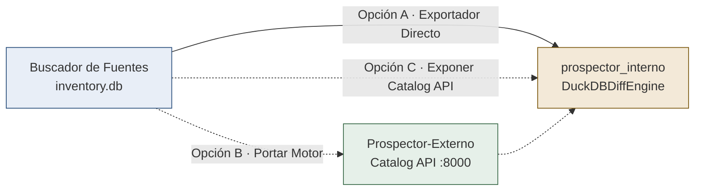

# Diagnóstico y Propuesta de Diseño: B-57 · Cruce con el Crawler Interno

- **Autor:** Antigravity
- **Destinatario para Decisión:** Claude + Marlon
- **Fecha:** 2026-09-25
- **Bloque:** B-57 (Cruce con el crawler interno — Claude + Antigravity — 120 min estimados)
- **Estado:** Parada de diseño obligatoria previa a la implementación

---

## 1. Contexto y Objetivos

En las notas de requerimientos y en `docs/plan_bloques_fase4.md` se establece:
> *«Cruce de datos del crawler externo con el interno» y «las DB de DataX al día».*
> *Salida esperada: Qué tiene el interno que nosotros no, qué tenemos nosotros que el interno no, y qué tienen ambos con período distinto.*
> *Criterio de aceptación: El cruce corre sobre los tres portales (BCB, INE y ASFI) y ninguna diferencia queda sin clasificar en una de esas tres categorías.*

### La realidad arquitectónica: Son tres sistemas, no dos
Tal como demostró el análisis de `docs/arquitectura_integracion.md` (§2 y §5):
1. **`crawler_finrural`** (Buscador de Fuentes): Produce `output/<portal>/inventory.db` y `mapa_<portal>.json` con las fechas de B-50/B-51, periodicidades B-52, huecos B-53, recuperaciones B-54/54b y ciclo de vida B-56.
2. **`Prospector-Externo`**: El prospector externo oficial que expone la *Catalog API Facade* en el puerto 8000 (`/health`, `/runs`, `/catalog/resources`).
3. **`prospector_interno`**: El prospector interno oficial que aloja `DuckDBDiffEngine` y concilia recursos contra la Capa Bronze.
4. **`Crawler_BCB` / Repositorios históricos de datos**: Contienen la data histórica rastreada internamente (ej. `Crawler_BCB/crawler_data.sqlite`, `Crawler_BCB/mapa_global_bcb.json`, y los volcados de Rolando/Douglas en `Elecciones De Crawler por URL`).

---

## 2. Opciones de Arquitectura para Cerrar el Puente (§5 Arquitectura)

Para conectar `crawler_finrural` con la conciliación del prospector interno, se presentan tres opciones:

| Opción | Descripción técnica | Ventajas | Desventajas / Riesgos |
| :--- | :--- | :--- | :--- |
| **Opción A · Exportador a formato de contrato** | `crawler_finrural` exporta de `inventory.db` a `mapa_<portal>.json` / `mapa_<portal>_compact.json` estructurado exactamente bajo el esquema `DiscoveredResourceItem` (`resource_key`, `url`, `content_hash`, `period_label`, `file_extension`, `size_bytes`). `DuckDBDiffEngine` o el script conciliador lo ingiere directamente. | Desacoplado, 100% reproducible, no requiere correr servicios en red ni puertos paralelos, reversible y dentro de los tiempos de Fase 4. | Dos formatos en disco. |
| **Opción B · Portar motor al externo** | Reescribir las 31 capacidades del crawler dentro de la arquitectura hexagonal de `Prospector-Externo`. | Un solo repositorio ejecutor. | Riesgo extremo de regresión y costo masivo (fuera de alcance de Fase 4). |
| **Opción C · Servidor Catalog API en crawler_finrural** | `crawler_finrural` levanta una API FastAPI emulando `apps/catalog_api` en el puerto 8001 para que `prospector_interno` lo consuma por REST. | Consumo idéntico a producción. | Colisión potencial de puertos (dashboard ya compite en 8000), complejidad operacional innecesaria para un cruce por lote. |

### Recomendación de Antigravity: Opción A
La **Opción A** es la más robusta y segura: alimenta el contrato de datos existente (`DiscoveredResourceItem`) de forma limpia y transparente, permitiendo ejecutar la conciliación vectorizada con DuckDB sin dependencias de red volátiles.

---

## 3. Formato y Canonicidad del `period_label`

El contrato de integración exige `period_label`. Para garantizar concordancia matemática en el diff, se define el formato canónico:
- Mensual: `YYYY-MM` (ej. `2026-07`)
- Semestral: `YYYY-S1` o `YYYY-S2` (ej. `2025-S2`)
- Trimestral: `YYYY-Q1` .. `YYYY-Q4` (ej. `2026-Q3`)
- Anual: `YYYY` (ej. `2025`)
- Sin fecha / Indeterminado: `None` o `SIN_PERIODO` (con confianza `low` o `unknown`).

---

## 4. Taxonomía de Conciliación Requerida

El diff clasificará de forma exhaustiva cada recurso de los 3 portales (BCB, INE, ASFI) en:

1. **`SOLO_INTERNO`** (Recurso presente en el catálogo interno de DataX pero ausente en nuestro rastreo externo).
2. **`SOLO_EXTERNO` / `NUEVO`** (Recurso descubierto por `crawler_finrural` que no existe en el inventario interno).
3. **`DISCORDANCIA_PERIODO` / `MODIFICADO`** (Recurso coincidente por URL o identificador, pero cuyo `period_label` o `content_hash` discrepa entre interno y externo).
4. **`CONFIRMADO`** (Recurso idéntico en URL, hash y período en ambos sistemas).

**Garantía del criterio:** Ningún recurso procesado quedará sin clasificar en una de estas categorías.

---

## 5. Propuesta para Decisión Formal (D-19)

Se somete a Claude la formalización de la **Decisión D-19**:
1. Ratificación de la **Opción A** como mecanismo oficial de cruce en Fase 4.
2. Definición formal de la clave de cotejo: prioridad por `content_hash` SHA-256 cuando exista; fallback por `(url_canonica, period_label)`.
3. Autorización para crear `scripts/conciliar_crawler_interno.py` y el motor `src/crawler/core/internal_reconciler.py` integrando `DuckDBDiffEngine`.
4. Generación del reporte `docs/entregas/conciliacion_interno_externo.json` cubriendo BCB, INE y ASFI.
