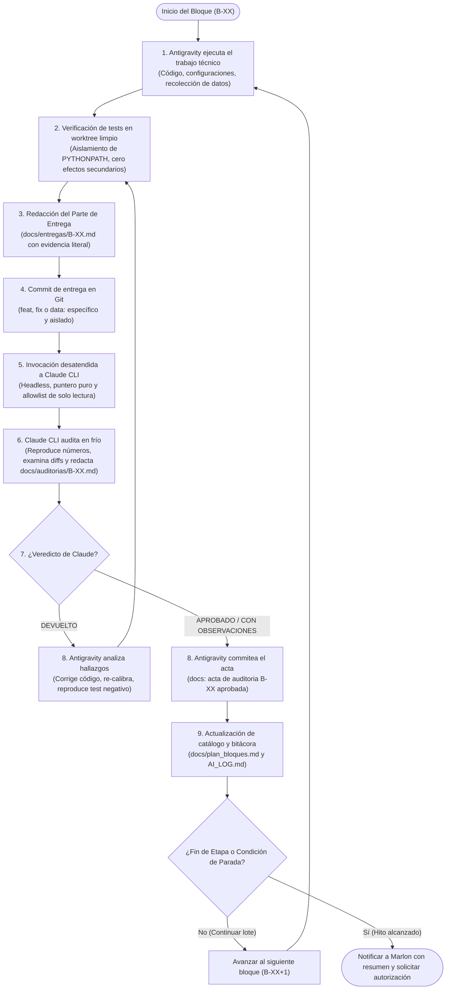

# Guía de Implementación — Bucle Automatizado entre Asistentes de IA (Antigravity ↔ Claude CLI)

Esta guía documenta la arquitectura, el protocolo operativo y la implementación técnica del **bucle automatizado de desarrollo y auditoría desatendida** entre dos inteligencias artificiales asimétricas:
- **Agente Ejecutor (Antigravity):** Diseña, implementa código, ejecuta scripts/crawlers, corre pruebas y documenta el parte de entrega.
- **Agente Auditor (Claude CLI):** Inspecciona el repositorio de forma independiente, ejecuta comprobaciones en frío, verifica las afirmaciones del parte y emite un acta vinculante con veredicto.

Este patrón elimina el cuello de botella del *copiar y pegar* manual entre interfaces de chat, manteniendo el rigor metodológico y la separación de roles.

---

## 1. Diagrama de Flujo del Bucle Autónomo



---

## 2. Las Tres Reglas Inquebrantables del Protocolo

Para evitar que la automatización degenere en "aprobación mutua complaciente", el sistema se rige por tres restricciones estrictas:

### Restricción 1 — Puntero puro, nunca un resumen
El agente ejecutor **jamás** debe enviar un resumen de lo que hizo ni explicar por qué su trabajo es correcto. Si el ejecutor resume, controla lo que el auditor ve.
- **Invocación correcta (mínima y neutral):**
  ```powershell
  claude -p "Audita B-XX siguiendo docs/protocolo_equipo.md. El parte está en docs/entregas/B-XX.md. Dejá el acta en docs/auditorias/B-XX.md."
  ```

### Restricción 2 — Asimetría y mínimos privilegios del Auditor
El auditor **no debe escribir código ni commitear cambios**. Su función es comprobar y emitir juicio:
- **Permitido al Auditor:** Herramientas de lectura de archivos (`Read`, `Grep`, `Glob`), inspección de Git (`git log`, `git show`, `git diff`), comandos de verificación en frío (`python`, `pytest`, `sqlite3`), y edición exclusiva en el directorio de actas (`Edit(docs/auditorias/**)`).
- **Prohibido al Auditor:** Modificaciones a archivos de código (`src/**`, `config/**`) y operaciones mutables de Git (`git add`, `git commit`, `git push`).

### Restricción 3 — Condiciones de parada explícitas
El bucle corre automáticamente entre bloques del mismo tipo, pero **debe detenerse** y consultar al supervisor humano si:
1. El veredicto no puede resolverse mediante código y requiere cambio de política/decisión.
2. Ocurre un bloqueo externo de infraestructura insalvable (p. ej., bloqueo WAF/Cloudflare con Captcha que requiera proxy institucional).
3. Se finaliza una etapa completa del plan (p. ej., fin de Etapa C).

---

## 3. Comando de Invocación Técnica (PowerShell / Windows)

El comando exacto utilizado por Antigravity para orquestar a Claude CLI de forma no interactiva:

```powershell
claude -p "Audita B-XX siguiendo docs/protocolo_equipo.md. El parte está en docs/entregas/B-XX.md. Dejá el acta en docs/auditorias/B-XX.md." `
  --allowedTools "Read Grep Glob Bash(git log:*) Bash(git show:*) Bash(git diff:*) Bash(python:*) Bash(git worktree add:*) Bash(git worktree remove:*) Edit(docs/auditorias/**) Edit(AI_LOG.md)" `
  --disallowedTools "Bash(git commit:*) Bash(git add:*) Bash(git push:*)"
```

### Explicación de banderas:
- `-p` (`--print`): Modo no interactivo (headless). Lee el prompt, ejecuta las herramientas autorizadas sin pedir confirmación por teclado, y escribe la respuesta final al terminar.
- `--allowedTools`: Define explícitamente las herramientas autorizadas. La sintaxis `Bash(comando:*)` permite al auditor ejecutar comprobaciones de solo lectura de forma segura.
- `--disallowedTools`: Bloquea taxativamente cualquier mutación del historial de Git por parte del auditor.

---

## 4. Guía para Replicar este Bucle en Otro Proyecto

Para adoptar este patrón en cualquier nuevo repositorio:

1. **Instalar y autenticar Claude CLI:**
   ```bash
   npm install -g @anthropic-ai/claude-code
   claude auth login
   ```
2. **Crear la estructura documental estándar:**
   - `docs/protocolo_equipo.md`: Define los roles, criterios de aceptación de cada bloque y formato obligatorio de partes y actas.
   - `docs/entregas/`: Directorio donde el agente ejecutor publica el parte `B-XX.md` con evidencia de consola literal.
   - `docs/auditorias/`: Directorio donde el agente auditor escribe su acta `B-XX.md` con el veredicto en mayúsculas (`APROBADO`, `APROBADO CON OBSERVACIONES` o `DEVUELTO`).
   - `docs/plan_bloques.md`: Tabla de seguimiento con estimaciones, tiempos reales y estados.
   - `AI_LOG.md`: Bitácora de lecciones aprendidas y correcciones metodológicas.
3. **Instrucción al Asistente Ejecutor (System Prompt / Contexto):**
   - Configurar al asistente ejecutor para que, tras commitear un bloque, lance el comando `claude -p "..."`, espere la notificación de finalización, lea el acta resultante y decida de forma autónoma si debe subsanar o avanzar.
